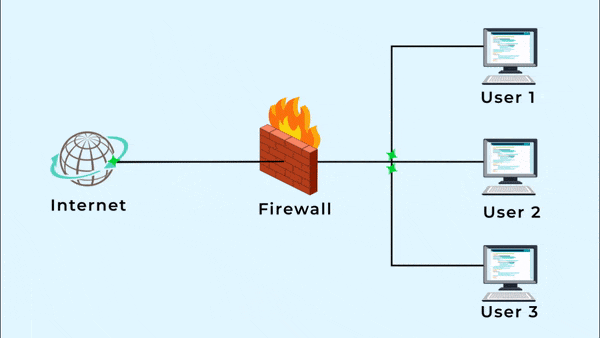

# Firewall Simulator 🧱



## Fire Wall Simple Theory

A program that sits at the interface between an internal network and an untrusted external network (e.g., the Internet).

- Monitors all incoming traffic.
- Evaluates traffic based on pre-determined rules.
- Two possible outcomes:
  - **Block** the traffic (data packets are dropped and not allowed into the internal network).
  - **Allow** the traffic to enter the internal network.
- A simple way to understand this:
  - A firewall is like an **algorithmic bouncer** standing at an entrance, deciding who enters and who doesn’t.

## Firewall Setup

- A **dictionary** defines the set of rules.
- **Traffic simulation** generates random IP numbers to simulate network traffic.
- The program applies rules to decide which traffic is allowed or blocked.
- Results are output to the terminal.

## How to Run

```bash
python FirewallSimulator.py
```
